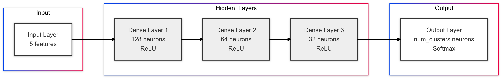
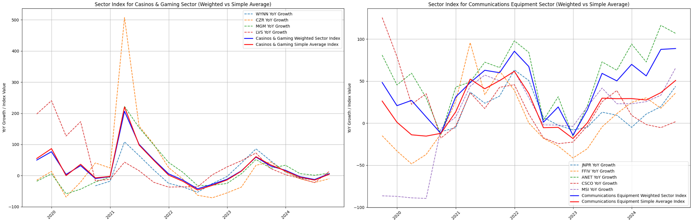
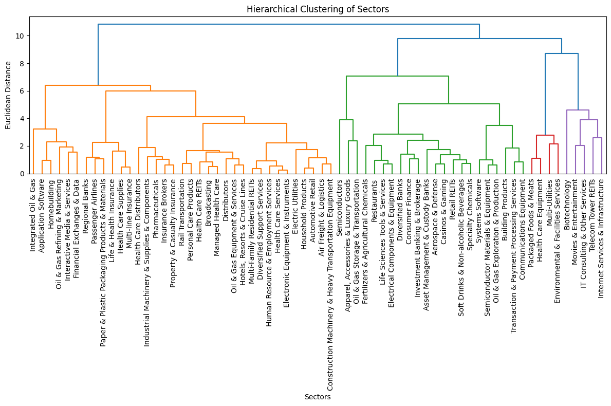

# Sector-Level Analysis and Clustering of S&P 500 Companies Using Financial Metrics and Machine Learning

***
***

## Abstract
[cite_start]Understanding the financial market structure and the positions of its players, i.e., companies and sectors, is of utmost importance[cite: 1]. [cite_start]While traditional methods are useful for interpreting financial statements, it is also crucial to understand the coherence of various sectors during market stress[cite: 2, 3]. [cite_start]The application of machine learning and statistics in financial markets has grown in importance[cite: 4]. [cite_start]This paper presents a comprehensive analysis of sector-level performance within the S&P 500, using a methodology that combines various financial metrics, clustering techniques, and neural networks[cite: 5]. [cite_start]Key metrics include market capitalization growth, revenue growth, performance variance (using weighted versus simple averages), and short- and long-term beta covariances[cite: 6]. [cite_start]This research identifies sector leaders, assesses market dominance, and explores sector stability[cite: 7]. [cite_start]It introduces an 'over-performance index' to identify which companies are perceived as leaders within a sector[cite: 8]. [cite_start]Additionally, inter-sector similarities are examined using clustering techniques, and a neural network classifies these sectors into clusters[cite: 10]. [cite_start]The findings provide critical insights into sector dynamics for investment decisions and identifying growth opportunities[cite: 11].

[cite_start]**Index Terms:** S&P 500, Financial Metrics, Clustering, Neural Networks, Sector Analysis, Overperformance Index, Financial Markets [cite: 12]

***

## I. INTRODUCTION

[cite_start]Large-Cap companies are key indicators of market trends and sectoral performance[cite: 12]. [cite_start]Understanding sector-level dynamics is essential for investors and policymakers[cite: 13]. [cite_start]This project integrates financial metrics, clustering techniques, and neural networks to analyze the competitive environment in various sectors[cite: 13]. [cite_start]By examining market capitalization, revenue growth, and variance, the project identifies monopolistic, duopolistic, and oligopolistic trends[cite: 14]. [cite_start]A neural network model is also used to classify sectors based on performance metrics, offering deeper insights into market behavior[cite: 15]. [cite_start]The main goal is to analyze sectors with monopolistic and oligopolistic environments[cite: 16]. [cite_start]To achieve this, an 'overperformance index' was developed, which utilizes a weighted average approach to better fit the variances to our specific requirements[cite: 17]. [cite_start]This index helps identify which companies in an industry over-perform the sector average[cite: 18]. [cite_start]After understanding each industry, they are clustered based on their normalized sector-wise performance[cite: 19]. [cite_start]Five parameters are formulated for each sector: year-on-year market capitalization growth, year-on-year revenue growth, the difference between simple and weighted average of year-on-year market capitalization growth, 6-month sector beta, and 4-year sector beta[cite: 20].

***

## II. THEORETICAL BACKGROUND

This research is founded on key economic concepts:

* [cite_start]**Market Structures:** The study focuses on identifying sectors characterized by monopoly, duopoly, and oligopoly[cite: 23].
    * [cite_start]A **monopoly** is a market where a single company dominates the sector[cite: 24].
    * [cite_start]A **duopoly** is a market where two companies dominate the sector[cite: 25].
    * [cite_start]An **oligopoly** is a market where several companies compete, with no single company being dominant[cite: 26].
* [cite_start]**Variance and Beta-Covariances:** These metrics are used to analyze and differentiate between market structures[cite: 28]. [cite_start]An index using a weighted average approach was developed to capture these metrics[cite: 29].

***

## III. METHODOLOGY

[cite_start]The methodology involves three main steps[cite: 30]:

### A. Data Preprocessing
[cite_start]Quarterly market capitalization and annual revenue data were merged, cleaned, and analyzed for each sector[cite: 31]. [cite_start]Key metrics like Year-over-Year (YoY) growth, weighted vs. simple averages, and beta covariance were calculated for each S&P 500 company[cite: 31]. [cite_start]Cumulative data was formed for each sector[cite: 32]. [cite_start]Only sectors with at least three listed companies in the S&P 500 were included to ensure data sufficiency and study quality[cite: 32, 33].

### B. Metrics and Equations

* [cite_start]**Market Cap/Revenue Growth Score:** [cite: 41]
    $$ \text{Return} = \frac{Y_i - Y_{i-1}}{Y_{i-1}} \quad (1) $$
    $$ \text{Score} = \begin{cases} 1 & \text{if value > mean + 0.07 * SD} \\ -1 & \text{if value < mean - 0.07 * SD} \\ 0 & \text{otherwise} \end{cases} \quad (2) $$
    [cite_start]A threshold of 0.07 is used, based on the idea that a company should grow more than the risk-free interest rate to attract investors[cite: 34].

* [cite_start]**Weighted-Simple Variance:** This is the absolute difference between the weighted and simple averages for a sector[cite: 35].
    The weight $w_i$ associated with a company is defined as:
    $$ w_i = \frac{c_i^2}{\sum c_j^2} \quad (4) $$
    [cite_start]where $c_i$ is the number of times company *i* outperformed the sector average[cite: 35].

* [cite_start]**Beta Covariance:** This measures the correlation of sector performance over time (short-term: 6 months; long-term: 4 years)[cite: 36].
    $$ \text{Mkt Value} = \frac{\text{Mkt Cap}(t)}{\text{Mkt Cap}(t-1)} - 1 \quad (5) $$
    $$ \text{Mkt Weight} = \frac{\text{Mkt Cap}(t)}{\sum \text{Mkt Value}(t)} \quad (6) $$
    $$ \text{Mkt Returns} = \sum (\text{Returns}(t) \cdot \text{Mkt Weight}(t)) \quad (7) $$
    $$ \beta = \frac{\text{Covariance}(\text{Returns}(t), \text{Mkt Returns}(t))}{\text{Variance}(\text{Mkt Returns}(t))} \quad (8) $$

### C. Sector Clustering
[cite_start]Five parameters were formulated for each sector: YoY market capitalization growth, YoY revenue growth, difference between simple and weighted average of YoY market cap growth, 6-month sector beta, and 4-year sector beta[cite: 20]. [cite_start]These parameters were normalized to prepare for clustering[cite: 43].
* [cite_start]**Hierarchical Clustering:** This was used to visualize cluster distances and determine the appropriate number of clusters[cite: 44].
* [cite_start]**K-Means Clustering:** This was performed using the number of clusters identified from the hierarchical clustering step[cite: 45].

### D. Overperformance Index
[cite_start]The weighted average growth of each sector was used to count the number of times each company outperformed the sector's mean growth[cite: 46]. [cite_start]This data was then used to create an overperformance-based index to classify sectors into monopolistic, duopolistic, or oligopolistic environments[cite: 47].

### E. Neural Network Model
[cite_start]A multi-layer perceptron (MLP) deep learning model was developed[cite: 48].
* [cite_start]**Input:** Normalized performance metrics for each sector[cite: 56].
* [cite_start]**Layers:** Three dense layers with ReLU activation, followed by a softmax layer for classification[cite: 57].
* [cite_start]**Output:** Cluster classification based on performance similarities[cite: 58].

*Fig. 1. [cite_start]Architecture of the Artificial Neural Network* [cite: 56]

[cite_start]The model was trained on 60% of the data and tested on the remaining 40%[cite: 52].

***

## IV. RESULTS AND DISCUSSION

[cite_start]Differences were observed for sectors with monopolistic and oligopolistic settings[cite: 59].

*Fig. 2. [cite_start]The difference between simple and weighted average is significant in Casinos & Gaming Sector (on the left) and Communication Equipment Sector (on the right)* [cite: 63]

Out of 66 sectors analyzed, the study found:
* [cite_start]**47 sectors** with an oligopolistic environment[cite: 54].
* [cite_start]**8 sectors** with a duopolistic environment[cite: 54].
* [cite_start]**11 sectors** with a nearly monopolistic environment based on market capitalization growth[cite: 54].

[cite_start]A dendrogram was created to visualize the hierarchical clustering and decide on the number of clusters for K-Means[cite: 49]. [cite_start]"Automobile Manufacturers" was identified as an outlier[cite: 50]. [cite_start]Four clusters were obtained and initialized for K-Means clustering[cite: 51].

*Fig. 3. [cite_start]Dendrogram representing 66 clusters and their distance for hierarchical clustering* [cite: 67]

[cite_start]**Confusion Matrix of Predicted Clusters** [cite: 60]

| True Label | Predicted 1 | Predicted 2 | Predicted 3 | Predicted 4 |
| :--------: | :---------: | :---------: | :---------: | :---------: |
| **1** | 6           | 0           | 1           | 0           |
| **2** | 8           | 0           | 0           | 1           |
| **3** | 0           | 0           | 0           | 2           |
| **4** | 0           | 0           | 0           | 9           |
[cite_start]*[Table data sourced from [cite: 61]]*

[cite_start]**Clustering Evaluation Metrics** [cite: 64]

| Metric                        | Score |
| ----------------------------- | :---: |
| Adjusted Rand Index (ARI)     | 0.76  |
| Normalized Mutual Information | 0.82  |
| Homogeneity                   | 0.81  |
| Completeness                  | 0.82  |
| V-measure                     | 0.82  |
| Fowlkes-Mallows Index         | 0.83  |
[cite_start]*[Table data sourced from [cite: 64]]*

[cite_start]The high scores indicate that the clustering aligns well with the true structure of the data[cite: 62]. [cite_start]The neural network classifier achieved an accuracy of **93%** using softmax activation[cite: 53].

***

## V. CONCLUSION

[cite_start]This research successfully analyzed the sector-wise performance within the S&P 500, offering valuable insights into market dynamics and sector clustering[cite: 67]. [cite_start]The methodology, combining financial metrics, hierarchical clustering, and neural networks, effectively revealed significant trends and patterns[cite: 68]. [cite_start]The study identified varying levels of market dominance, classifying 49 sectors as oligopolistic, 8 as duopolistic, and 12 as monopolistic based on market cap growth[cite: 69]. [cite_start]Inter-sector relationships were successfully identified using hierarchical and K-means clustering[cite: 70]. [cite_start]The neural network model demonstrated a high classification accuracy of 93%[cite: 71]. [cite_start]These findings are important for strategic investment, policy formulation, and market analysis by providing a deeper understanding of sector-level stability and competitive dynamics[cite: 72]. [cite_start]This research highlights the effectiveness of combining financial expertise with data science and machine learning[cite: 74]. [cite_start]Future work could incorporate ESG metrics, international market data, and more advanced deep learning models[cite: 73].

***

## References

[1] T. Conlon, J. Cotter, and I. M. Tuna, "Network topology and financial sector risk," *Journal of Financial Stability*, vol. 62, p. 101050, 2022.

[2] A. G. F. Stapel, S. A. G. Van Wingerden, and M. A. Van Dijk, "Fifty years of stock-return-comovement: A review of the literature," *Journal of Commodity Markets*, vol. 27, p. 100223, 2022.

[3] N. F. F. da Silva, F. H. F. D. S. and L. A. S. Dias, L. A. S. de Oliveira, and L. A. S. de Oliveira, “Deep learning for stock market prediction: A review and a new methodology,” *Applied Soft Computing*, vol. 147, p. 110756, 2023.

[4] S. H. Nasiri, S. M. A. H. Hosseini, and M. R. Feizi-Derakhshi, "An effective stock market prediction model using a hybrid clustering and classification-based approach," *Journal of Ambient Intelligence and Humanized Computing*, vol. 15, no. 1, pp. 493-509, 2024.

[5] G. S. Atsalakis and K. P. Valavanis, "Surveying stock market forecasting techniques – Part II: Soft computing methods," *Expert Systems with Applications*, vol. 36, no. 3, pp. 5932-5941, 2009.

[6] G. J. Mantegna, "Hierarchical structure in financial markets," *The European Physical Journal B-Condensed Matter and Complex Systems*, vol. 11, no. 1, pp. 193-197, 1999.

[7] Z. Bodie, A. Kane, and A. J. Marcus, *Investments*, 12th ed. McGraw-Hill Education, 2020.

[8] J. MacQueen, "Some methods for classification and analysis of multivariate observations," in *Proceedings of the fifth Berkeley symposium on mathematical statistics and probability*, vol. 1, no. 14, pp. 281-297, 1967.

[9] J. Tirole, *The Theory of Industrial Organization*. MIT press, 1988.